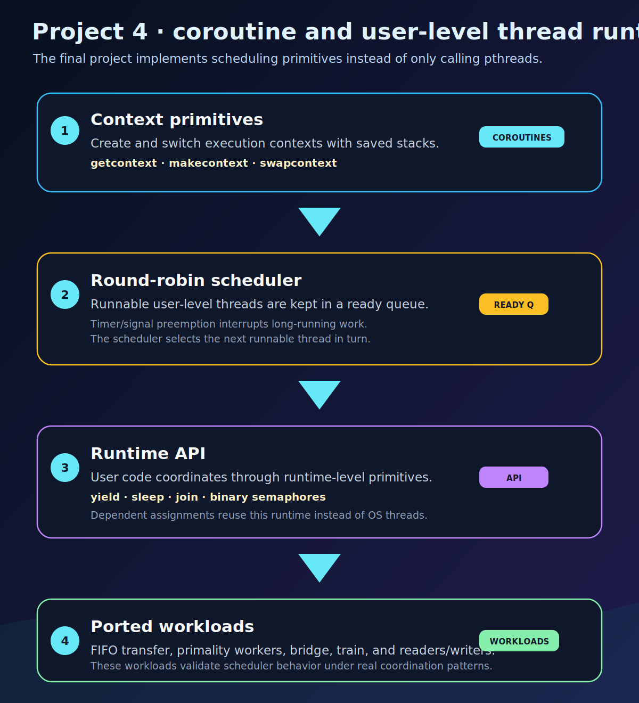
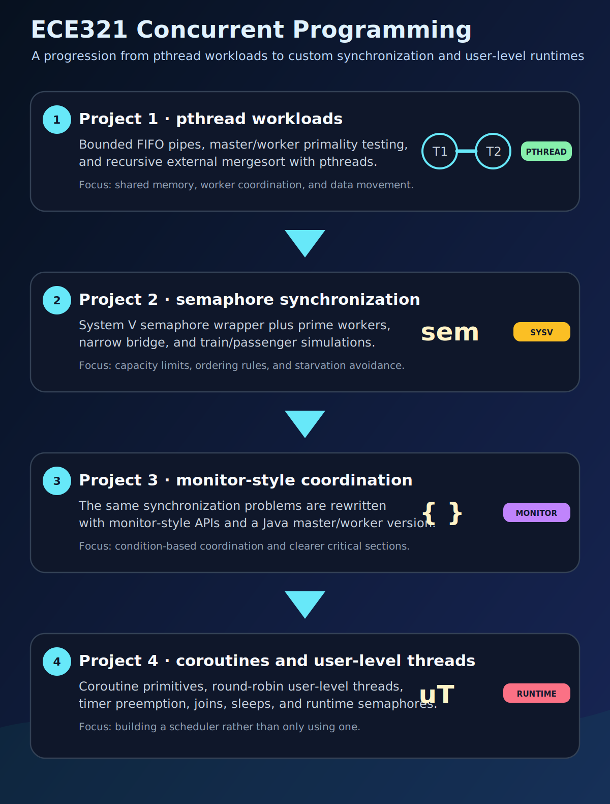

# ECE321 — Concurrent Programming


Coursework repository for **ECE321 — Concurrent Programming** at the **University of Thessaly**. The projects are implemented primarily in C and cover pthread-based synchronization, custom semaphore abstractions, monitor-style coordination, coroutines, and user-level threads.

The repository includes root-level build and validation scripts so the assignments can be compiled and exercised from a clean checkout.

## Quick overview

| Area | What is included |
| --- | --- |
| Pthreads and synchronization | FIFO pipes, primality workers, external mergesort, and pthread-based coordination workloads. |
| Semaphores and monitors | Custom binary semaphore APIs, monitor-style synchronization, narrow bridge coordination, and train/passenger simulations. |
| Coroutine runtime | `ucontext`-based coroutine primitives used to run earlier workloads without relying on OS threads. |
| User-level threads | Round-robin scheduling, timer/signal preemption, `yield`, `sleep`, `join`, runtime semaphores, and assignment ports. |

## Standout work: user-level threading runtime

The strongest part of the repository is **Project 4**, where the earlier synchronization workloads are ported onto a custom coroutine and user-level threading runtime. Instead of only using pthreads or OS-provided blocking primitives, the project builds the scheduling layer itself and then runs real assignment workloads on top of it.

- **Coroutine foundation:** `getcontext`, `makecontext`, `setcontext`, and `swapcontext` are wrapped into reusable coroutine primitives with explicit context switching.
- **User-level thread runtime:** Project 4 adds round-robin scheduling, timer/signal-based preemption, `yield`, `sleep`, `join`, and runtime-level binary semaphores.
- **Workload ports:** FIFO file transfer, primality workers, narrow bridge, train/passenger synchronization, and readers/writers are adapted to run on the custom runtime.
- **Runtime validation:** the final assignments exercise the scheduler through realistic coordination patterns rather than isolated toy calls.

<p align="center">
  
</p>

## Assignment overview

<p align="center">
  
</p>

| Path | Assignment | Implementation summary |
|---|---|---|
| [`Project1/assignment1`](Project1/assignment1/) | 1.1 FIFO pipes | One-direction FIFO pipe library backed by a bounded ring buffer. The test program transfers a file through two pipes and validates `.copy` and `.copy2` outputs. |
| [`Project1/assignment2`](Project1/assignment2/) | 1.2 Primality tester | Master/worker pthread program that dispatches input integers to worker threads for primality testing. |
| [`Project1/assignment3`](Project1/assignment3/) | 1.3 External mergesort | Parallel external mergesort for a binary file of integers. Recursive work is split across dynamically created pthreads. |
| [`Project2/assignment1`](Project2/assignment1/) | 2.1 Binary semaphores | Custom binary semaphore API implemented over System V semaphores. |
| [`Project2/assignment2`](Project2/assignment2/) | 2.2 Primality tester with semaphores | Semaphore-based version of the primality worker scheduler from Assignment 1.2. |
| [`Project2/assignment3`](Project2/assignment3/) | 2.3 Narrow bridge | Semaphore-based simulation that coordinates cars crossing a one-lane bridge with direction, capacity, and starvation constraints. |
| [`Project2/assignment4`](Project2/assignment4/) | 2.4 Train ride | Semaphore-based train/passenger synchronization simulation with fixed train capacity and batched boarding/unboarding. |
| [`Project3/assignment1`](Project3/assignment1/) | 3.1 Binary semaphores with monitor-style synchronization | Revised binary semaphore implementation using monitor-style synchronization. |
| [`Project3/assignment2`](Project3/assignment2/) | 3.2 Primality tester with monitor-style synchronization | Monitor-style version of the primality worker scheduler. |
| [`Project3/assignment2_java`](Project3/assignment2_java/) | 3.2 Java implementation | Java implementation of the master/worker primality-testing assignment. |
| [`Project3/assignment3`](Project3/assignment3/) | 3.3 Narrow bridge with monitor-style synchronization | Monitor-style solution for the narrow bridge simulation. |
| [`Project3/assignment4`](Project3/assignment4/) | 3.4 Train ride with monitor-style synchronization | Monitor-style solution for the train/passenger simulation. |
| [`Project4/list`](Project4/list/) | Shared list utility | Intrusive list helper used by the coroutine and user-level-thread runtimes. |
| [`Project4/assignment1`](Project4/assignment1/) | 4.1 Coroutines | Coroutine library built on `getcontext`, `makecontext`, `setcontext`, and `swapcontext`, validated with the FIFO file-transfer workload. |
| [`Project4/assignment2`](Project4/assignment2/) | 4.2 User-level threads | User-level thread runtime with round-robin scheduling, timer/signal-based preemption, `yield`, `sleep`, `join`, and binary semaphores. |
| [`Project4/assignment3`](Project4/assignment3/) | 4.3 Readers/writers | Readers/writers simulation implemented on top of the custom user-level thread and semaphore runtime. |
| [`Project4/project1_assignment1`](Project4/project1_assignment1/) | Assignment 1.1 port | FIFO file-transfer workload adapted to the user-level thread runtime. |
| [`Project4/project2_assignment2`](Project4/project2_assignment2/) | Assignment 2.2 port | Primality worker scheduler adapted to the user-level thread runtime. |
| [`Project4/project2_assignment3`](Project4/project2_assignment3/) | Assignment 2.3 port | Narrow bridge simulation adapted to the user-level thread runtime. |
| [`Project4/project2_assignment4`](Project4/project2_assignment4/) | Assignment 2.4 port | Train/passenger simulation adapted to the user-level thread runtime. |

## Requirements

- Linux environment
- `gcc`
- `make`
- POSIX threads (`pthread`)
- System V semaphore support
- GNU `timeout` from coreutils, used by the validation script
- Java JDK (`javac`, `java`, `jar`) for the Java implementation in `Project3/assignment2_java`
- Optional: `valgrind` for coroutine/user-level-thread debugging

On Debian-based systems:

```bash
sudo apt update
sudo apt install build-essential default-jdk coreutils valgrind
```

## Build and test

Build all supported C targets and the Java assignment:

```bash
make build
```

Run the repository validation checks:

```bash
make test
```

Clean generated build/test files:

```bash
make clean
```

Print the assignment inventory:

```bash
make list
```

The root commands are implemented in:

```text
scripts/build_all.sh
scripts/test_all.sh
scripts/clean_all.sh
scripts/list_assignments.sh
```

## Running individual assignments

Each assignment directory keeps its own `Makefile`. Most assignments also include a `run_test.sh` script with predefined inputs.

Example:

```bash
cd Project2/assignment3
make
./run_test.sh -5
```

Another example:

```bash
cd Project4/assignment3
make
./run_test.sh -1
```

Some assignments depend on libraries built by earlier directories. Running the root build first is the simplest way to prepare all dependencies:

```bash
make build
```

Dependency examples:

- `Project2/assignment2`, `Project2/assignment3`, and `Project2/assignment4` link against `Project2/assignment1/target/libmysem.a`.
- `Project3/project2_assignment3` and `Project3/project2_assignment4` link against `Project3/assignment1/target/libmysem.a`.
- `Project4/assignment2` depends on `Project4/assignment1` and `Project4/list`.
- `Project4/project1_assignment1` and `Project4/project2_assignment*` link against `Project4/assignment2/target/libmythreads.a`.
